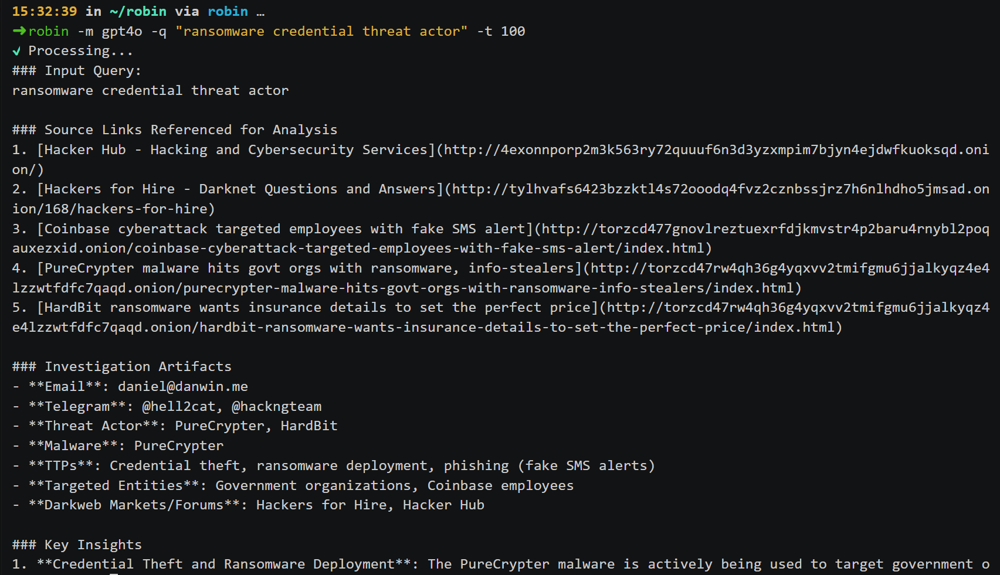
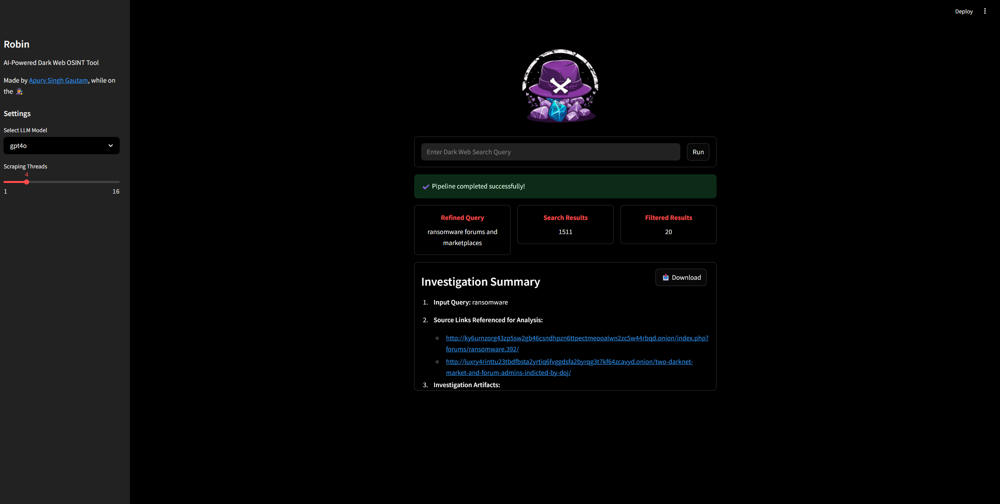

<div align="center">
   
   <br><a href="https://github.com/apurvsinghgautam/robin/actions/workflows/binary.yml"></a> <a href="https://github.com/apurvsinghgautam/robin/releases"></a> <a href="https://hub.docker.com/r/apurvsg/robin"></a>
   <h1>Robin: AI-Powered Dark Web OSINT Tool</h1>

   <p>Robin is an AI-powered tool for conducting dark web OSINT investigations. It leverages LLMs to refine queries, filter search results from dark web search engines, and provide an investigation summary.</p>
   <a href="#installation">Installation</a> &bull; <a href="#usage">Usage</a> &bull; <a href="#contributing">Contributing</a> &bull; <a href="#acknowledgements">Acknowledgements</a><br><br>
</div>





---

## Features

- ⚙️ **Modular Architecture** – Clean separation between search, scrape, and LLM workflows.
- 🤖 **Multi-Model Support** – Easily switch between OpenAI, Claude, Gemini or local models like Ollama.
- 💻 **CLI-First Design** – Built for terminal warriors and automation ninjas.
- 🐳 **Docker-Ready** – Optional Docker deployment for clean, isolated usage.
- 📝 **Custom Reporting** – Save investigation output to file for reporting or further analysis.
- 🧩 **Extensible** – Easy to plug in new search engines, models, or output formats.
- 🔒 **Content Filtering** – Configurable allowlist/blocklist for controlling what content gets analyzed. See [CONTENT_FILTERING.md](CONTENT_FILTERING.md) for details.
- 📊 **Automatic Chunking** – Handles large datasets by automatically splitting content to avoid LLM token limits.

---

## ⚠️ Disclaimer
> This tool is intended for educational and lawful investigative purposes only. Accessing or interacting with certain dark web content may be illegal depending on your jurisdiction. The author is not responsible for any misuse of this tool or the data gathered using it.
>
> Use responsibly and at your own risk. Ensure you comply with all relevant laws and institutional policies before conducting OSINT investigations.
>
> Additionally, Robin leverages third-party APIs (including LLMs). Be cautious when sending potentially sensitive queries, and review the terms of service for any API or model provider you use.

## Installation
> [!NOTE]
> The tool needs Tor to do the searches. You can install Tor using `apt install tor` on Linux/Windows(WSL) or `brew install tor` on Mac. Once installed, confirm if Tor is running in the background.

> [!TIP]
> You can provide OpenAI or Anthropic or Google API key by either creating .env file (refer to sample env file in the repo) or by setting env variables in PATH.
>
> For Ollama, provide `http://host.docker.internal:11434` as `OLLAMA_BASE_URL` in your env if running using docker method or `http://127.0.0.1:11434` for other methods. You might need to serve Ollama on 0.0.0.0 depending on your OS. You can do that using `OLLAMA_HOST=0.0.0.0 ollama serve &`.

### Windows Setup (Native)

For Windows users running Robin natively (without Docker/WSL):

1. **Install Tor Expert Bundle:**
   ```powershell
   curl -o tor-expert-bundle.tar.gz https://archive.torproject.org/tor-package-archive/torbrowser/15.0.1/tor-expert-bundle-windows-x86_64-15.0.1.tar.gz
   tar -xzf tor-expert-bundle.tar.gz
   ```

2. **Create .env file** in the project root with your API keys:
   ```env
   OPENAI_API_KEY=your_openai_api_key_here
   ANTHROPIC_API_KEY=your_anthropic_api_key_here
   GOOGLE_API_KEY=your_google_api_key_here
   OLLAMA_BASE_URL=http://127.0.0.1:11434
   
   # Content Filtering (Optional) - See CONTENT_FILTERING.md for details
   CONTENT_ALLOWLIST=
   CONTENT_BLOCKLIST=
   FILTER_NSFW=true
   FILTER_IRRELEVANT=true
   MAX_RESULTS=20
   ```

3. **Tor will start automatically** when you run `python main.py ui` or `python main.py cli`. No manual Tor service management needed!

### Docker (Web UI Mode) [Recommended]

```bash
docker run --rm \
   -v "$(pwd)/.env:/app/.env" \
   --add-host=host.docker.internal:host-gateway \
   -p 8501:8501 \
   apurvsg/robin:latest ui --ui-port 8501 --ui-host 0.0.0.0
```

### Release Binary (CLI Mode)

- Download the appropriate binary for your system from the [latest release](https://github.com/apurvsinghgautam/robin/releases/latest)
- Unzip the file, make it executable 
```bash
chmod +x robin
```

- Run the binary as:
```bash
robin cli --model gpt-4.1 --query "ransomware payments"
```

### Using Python (Development Version)

- With `Python 3.10+` installed, run the following:

```bash
pip install -r requirements.txt
python main.py -m gpt-4.1 -q "ransomware payments" -t 12
```

---

## Content Filtering

Robin supports configurable content filtering to give you control over what data gets analyzed. You can:

- **Block specific keywords** - Automatically exclude content containing certain terms
- **Allow specific keywords** - Override filters for investigation-relevant content
- **Toggle NSFW filtering** - Control whether sensitive content is included
- **Set result limits** - Process anywhere from 20 to ALL search results (with automatic chunking)

For complete documentation on content filtering, allowlists, blocklists, and best practices, see **[CONTENT_FILTERING.md](CONTENT_FILTERING.md)**.

---

## Usage

```bash
Robin: AI-Powered Dark Web OSINT Tool

options:
  -h, --help            show this help message and exit
  --model {gpt4o,gpt-4.1,claude-3-5-sonnet-latest,llama3.1,gemini-2.5-flash}, -m {gpt4o,gpt-4.1,claude-3-5-sonnet-latest,llama3.1,gemini-2.5-flash}
                        Select LLM model (e.g., gpt4o, claude sonnet 3.5, ollama models, gemini 2.5 flash)
  --query QUERY, -q QUERY
                        Dark web search query
  --threads THREADS, -t THREADS
                        Number of threads to use for scraping (Default: 5)
  --output OUTPUT, -o OUTPUT
                        Filename to save the final intelligence summary. If not provided, a filename based on the
                        current date and time is used.

Example commands:
 - robin -m gpt4o -q "ransomware payments" -t 12
 - robin --model claude-3-5-sonnet-latest --query "sensitive credentials exposure" --threads 8 --output filename
 - robin -m llama3.1 -q "zero days"
 - robin -m gemini-2.5-flash -q "zero days"
```

---

## Contributing

Contributions are welcome! Please feel free to submit a Pull Request.

- Fork the repository
- Create your feature branch (git checkout -b feature/amazing-feature)
- Commit your changes (git commit -m 'Add some amazing feature')
- Push to the branch (git push origin feature/amazing-feature)
- Open a Pull Request

Open an Issue for any of these situations:
- If you spot a bug or bad code
- If you have a feature request idea
- If you have questions or doubts about usage

---

## Acknowledgements

- Idea inspiration from [Thomas Roccia](https://x.com/fr0gger_) and his demo of [Perplexity of the Dark Web](https://x.com/fr0gger_/status/1908051083068645558).
- Tools inspiration from my [OSINT Tools for the Dark Web](https://github.com/apurvsinghgautam/dark-web-osint-tools) repository.
- LLM Prompt inspiration from [OSINT-Assistant](https://github.com/AXRoux/OSINT-Assistant) repository.
- Logo Design by my friend [Tanishq Rupaal](https://github.com/Tanq16/)

